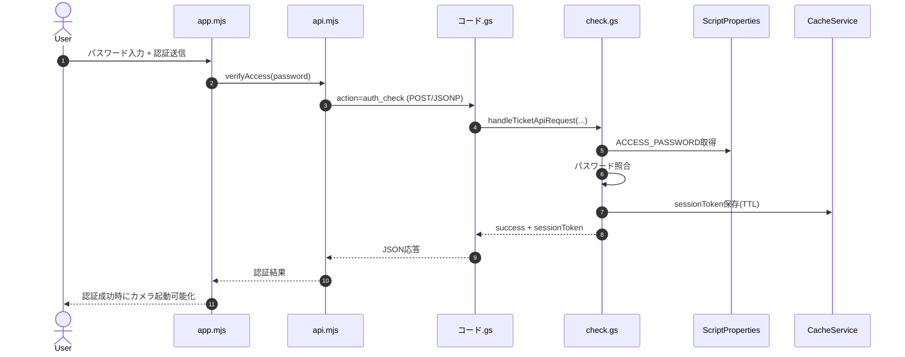
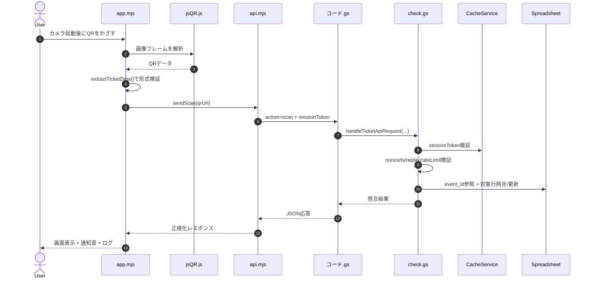

# QR Check-in (GitHub Pages + Google Apps Script)

このプロジェクトは、GitHub Pages で公開する QR 読み取り画面から、Google Apps Script (GAS) の API に照会して、スプレッドシート上でチケット整合性チェックと入場処理を行う構成です。

## 重要事項（先に読む）

- `jsQR.js` は QR 読み取りライブラリ本体です。運用上、**編集しない**前提です。
- 公開ページに直接アクセスされても API を濫用されないよう、**カメラ起動前のパスワード認証**を必須化しています。
- パスワードはフロント側ファイルに置きません。**GAS Script Properties の `ACCESS_PASSWORD`** に設定します。

## ファイル構成と役割

- `camera_fca8108af67841109ef2112ba7d7accf.html`: 画面骨組み（認証フォーム、カメラ領域、ログ表示）
- `styles.css`: 画面スタイル
- `config.mjs`: クライアント設定（GAS URL、タイムアウト、スキャン間隔など）
- `api.mjs`: GAS 通信層（`auth_check` と `scan`、POST→JSONPフォールバック）
- `app.mjs`: UI制御とスキャン実行本体
- `jsQR.js`: QR デコードライブラリ（編集禁止運用）
- `コード.gs`: GAS HTTP エントリポイント（`doPost` / `doGet`）
- `check.gs`: GAS 業務ロジック（認証、検証、シート更新、ログ記録）

## 処理フロー

### 1. 認証フロー（カメラ起動前）

1. ユーザーがパスワード入力
2. `app.mjs` -> `api.mjs.verifyAccess(password)` 呼び出し
3. `api.mjs` が `action: "auth_check"` で GAS へ送信
4. GAS (`check.gs`) が `ACCESS_PASSWORD` と照合
5. 成功時、GAS が `sessionToken` を返却（CacheServiceでTTL管理）
6. `api.mjs` が `sessionToken` をメモリ保持
7. 認証成功後のみ「カメラ起動」ボタンを有効化

### 2. QR照合フロー

1. カメラ映像を canvas に描画
2. `jsQR()` で QR を検出
3. `app.mjs.extractTicketData()` で型・形式チェック
4. `api.mjs.sendScan()` が `action: "scan"` と `sessionToken` を送信
5. GAS (`check.gs`) が `sessionToken` 検証
6. GAS が QR パラメータを復号し、`event_id` から対象シート決定
7. 対象シートで token/year/event を照合
8. 未入場なら `ステータス=true`, `状態=入場済み`, `入場時刻` を更新
9. GASレスポンスを受けて、画面表示・通知音・ログ更新

## 依存関係

### フロントエンド

- ブラウザ標準API（`getUserMedia`, `fetch`, `AbortController`, `TextEncoder`, `Web Audio API`）
- `jsQR.js`（ローカル同梱）

### サーバー（GAS）

- `ContentService`
- `SpreadsheetApp`
- `LockService`
- `CacheService`
- `PropertiesService`
- `Utilities`

## 必須設定

### 1. `config.mjs`（GitHub側）

- `GAS_WEB_APP_URL` を実際の Web アプリ URL に変更

### 2. GAS Script Properties

- キー: `ACCESS_PASSWORD`
- 値: 運用パスワード

補足:
- `ACCESS_PASSWORD` 未設定時、認証APIは 500 を返します。
- パスワードは GitHub リポジトリに置かないでください。

### 3. スプレッドシート

- `event_id` シートが必要
- `log` シートが必要（監査ログ用）
- 参加者シートには最低限、以下ヘッダが必要
  - `token`
  - `年度`
  - `イベント名`
  - `ステータス`
  - `状態`
  - `入場時刻`

推奨ヘッダ（なくても動作は可能）:
- `クラス番号`
- `生徒との続柄`

## API入力仕様（概要）

### `action: "auth_check"`

必須フィールド:
- `requestId`
- `ts`
- `nonce`
- `action`
- `password`
- `client.ua`
- `client.tz`

### `action: "scan"`

必須フィールド:
- `requestId`
- `ts`
- `nonce`
- `action`
- `qrUrl`
- `sessionToken`（legacyルート除く）
- `client.ua`
- `client.tz`

## セキュリティ対策（実装済み）

- カメラ起動前のパスワード認証
- セッショントークン検証（TTL付き、CacheService）
- `nonce` 再利用拒否（リプレイ対策）
- タイムスタンプ許容範囲チェック
- token単位レート制限
- 認証試行回数レート制限
- スプレッドシート式インジェクションを考慮したログ書き込み
- クライアント側で不正QR形式を事前遮断

## デプロイ手順（推奨）

1. GAS 側ファイル（`コード.gs`, `check.gs`）を反映
2. Script Properties に `ACCESS_PASSWORD` を登録
3. GAS を Web アプリとしてデプロイ（URL取得）
4. `config.mjs` の `GAS_WEB_APP_URL` を更新
5. GitHub Pages に `camera_fca8108af67841109ef2112ba7d7accf.html`, `styles.css`, `config.mjs`, `api.mjs`, `app.mjs`, `jsQR.js` を配置
6. 実機で「認証 → カメラ起動 → QR照合」を確認

## よくあるエラー

- `GAS_WEB_APP_URL が未設定です`
  - `config.mjs` の URL がプレースホルダのまま
- 認証が常に失敗
  - GAS Script Properties の `ACCESS_PASSWORD` 未設定 or 不一致
- 401（認証セッション無効）
  - セッション期限切れ。再認証が必要
- 404（該当チケットが見つかりません）
  - QRデータ、`event_id`、参加者シートデータの不一致

## 運用メモ

- パスワードは定期的に更新し、漏洩が疑われる場合は即変更
- `DEBUG` を本番で `false` にして、クライアントログを最小化
- 大規模運用では、IP制限やWAF相当の外部防御も併用推奨

